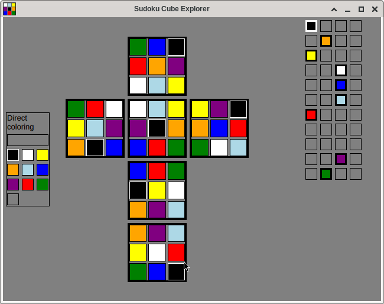

# SudokuCube

SudokuCube is an interactive desktop app for exploring and solving the colored Sudoku Cube puzzle (also known as Molecube).

Instead of solving only by trial and error, you can inspect valid placements, compare variants, and understand why a move works.



## Why SudokuCube?

- Visual and hands-on: inspect faces, edges, and corners in a clear UI.
- Built for discovery: test combinations and learn the puzzle's structure.
- Solution-focused: includes analysis material and categorized solution sets.

## Features

- Interactive Qt Quick interface.
- Color, face, edge, and corner variant models.
- Organized solution collections in the `solutions/` folder.
- Additional analysis notes for comparing solution categories.

## Quick Start

### Requirements

- CMake 3.14+
- C++17 compiler
- Qt 5 or Qt 6 (`Core`, `Quick`)
- Boost 1.66+

### Build

```bash
cmake -S . -B build
cmake --build build
```

### Run

```bash
./build/src/SudokuCube
```

## Solution Analysis

According to the manufacturer, the puzzle has 80 solutions.

You can find detailed notes and categorized examples here:

- [Solution Guide](solutions/solutions.org)
- [Comparison Notes](solutions/comparison.org)
- Additional sets inside `solutions/`

## Project Structure

- `src/` - application source code and QML UI
- `solutions/` - sample solutions and analysis documents

## Contributing

Contributions are welcome. If you want to improve the solver logic, UI, or documentation, open an issue or submit a pull request.

## License

This project is distributed under the terms of the license in [LICENSE](LICENSE).
